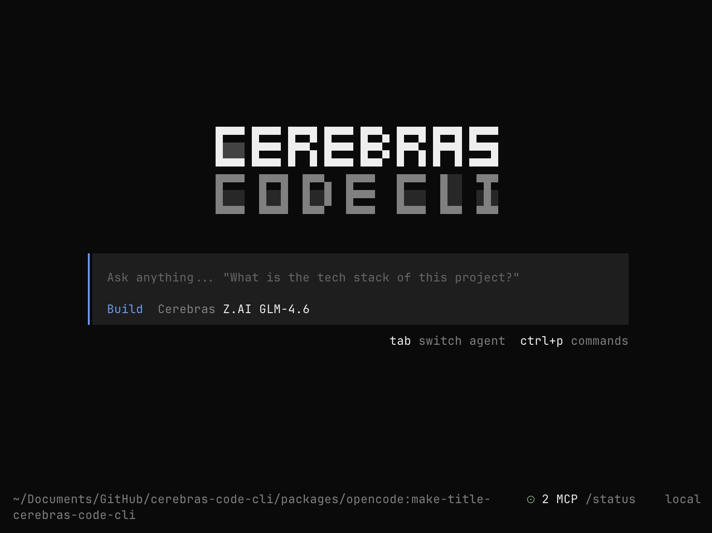

<p align="center">
  
</p>

<h1 align="center">Cerebras Code CLI</h1>

<p align="center">
  <strong>The blazing-fast AI coding agent for the terminal — powered by Cerebras inference.</strong>
</p>

<p align="center">
  <em>Fork of <a href="https://github.com/sst/opencode">OpenCode</a>, optimized for Cerebras's lightning-fast inference.</em>
</p>

<p align="center">
  
</p>

---

## ⚡ Why Cerebras?

Cerebras delivers AI inference **10-20x faster** than traditional cloud providers. Get instant responses in milliseconds, not seconds.

---

## 🚀 Installation

### npm (recommended)

```bash
npm install -g @cerebras/code-cli
cerebras-code
```

### npx (no install)

```bash
npx @cerebras/code-cli
```

### From source

```bash
git clone https://github.com/kevint-cerebras/cerebras-code-cli.git
cd cerebras-code-cli
bun install
cd packages/opencode
bun dev
```

---

## 🔑 Get Your API Key

1. Visit [cloud.cerebras.ai](https://cloud.cerebras.ai)
2. Create a free account
3. Generate an API key
4. Enter it when prompted on first run

**Free tier includes:**
- 10 requests/minute
- 60,000 tokens/minute
- 1M tokens/day

---

## ✨ Features

| Feature | Description |
|---------|-------------|
| ⚡ **Instant Responses** | Cerebras inference in milliseconds |
| 🖥️ **Terminal Native** | Beautiful TUI with vim-style keybindings |
| 🔧 **Full Coding Agent** | Edit files, run commands, analyze code |
| 📊 **Cache Monitoring** | Real-time hit rate with sparklines |
| 🔌 **MCP Support** | Extend with Model Context Protocol |
| 🎨 **28 Themes** | Catppuccin, Dracula, Nord, and more |

---

## 🤖 Agent Modes

Press `Tab` to switch:

- **code** — Full access for development (default)
- **ask** — Read-only for analysis and questions

---

## ⌨️ Key Shortcuts

| Shortcut | Action |
|----------|--------|
| `Ctrl+X n` | New session |
| `Ctrl+X l` | List sessions |
| `Ctrl+X b` | Toggle sidebar |
| `Ctrl+X t` | Change theme |
| `Tab` | Cycle modes |
| `Escape` | Interrupt |
| `Ctrl+C` | Exit |

Type `/help` for all commands.

---

## ⚙️ Configuration

```bash
# ~/.config/opencode/config.json
{
  "model": "cerebras/zai-glm-4.7",
  "theme": "opencode"
}
```

---

## 📝 License

MIT © [Cerebras](https://cerebras.ai)

---

<p align="center">
  <strong>Built with ⚡ by Cerebras</strong>
</p>
