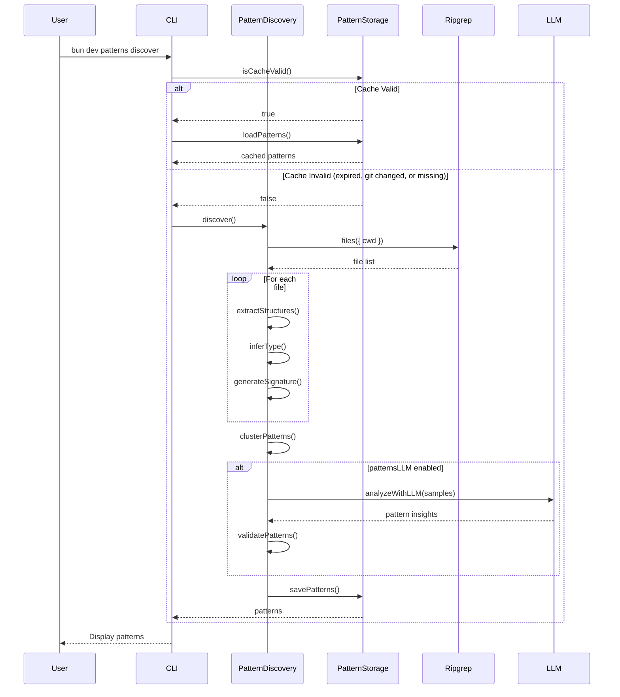
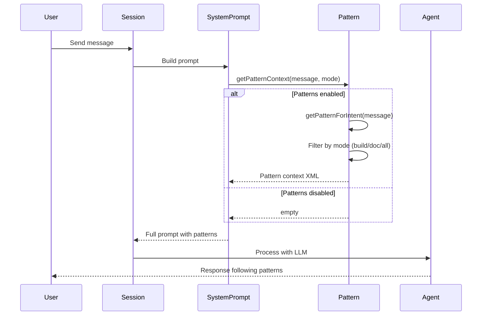

# Meta-Style Pattern Discovery

Automatically discovers, stores, and utilizes coding patterns from a project's codebase to enhance code generation and reduce AI "slop".

## Overview

Pattern Discovery analyzes your codebase to identify recurring code structures, naming conventions, and architectural patterns. These patterns are then injected into the AI's context to ensure generated code matches your project's style.

## Quick Start

```bash
# Discover patterns in your project
bun dev patterns discover

# Show discovered patterns
bun dev patterns show

# Show all patterns (lower confidence threshold)
bun dev patterns show --threshold 0.3

# Explain patterns matching a filter
bun dev patterns explain --filter api

# Export markdown report
bun dev patterns export

# Clear pattern cache
bun dev patterns clear
```

## Configuration

Add to your `.cerebras/cerebras.json`:

```json
{
  "experimental": {
    "patterns": true,
    "patternsLLM": false
  }
}
```

| Option | Default | Description |
|--------|---------|-------------|
| `patterns` | `true` | Enable pattern discovery |
| `patternsLLM` | `false` | Use LLM to validate low-confidence patterns |

## How It Works

https://mermaid.ai/play?utm_source=mermaid_live_editor&utm_medium=share#pako:eNqdVEtPwzAM_ivWTkNif6CHXZiQkIaEGI8LF5OYzFKWhiQdG4j_jrN2LaMdrxyqxv7sz8-8jVSpaVSMIj1X5BTNGE3A1YMDOR5DYsUeXYLbSKEvPZtf9IVXmBIFN-OoyjWF7VHEIpUBDfX11-xNIN9XzOeXD64W54Am06lEUMBj5UDTWqA7vxF0w11DBSPIQ9ICOJ6hWtIdWtbjkxpZf9FKZlkHO2UtzOfQxWRPn0JFHWiYzZaoG1ncs33jUmV63SZU48lGagK7cOscGoxp4zmQPgXDCdQSncmXMsCKY2RnfqZ6QnF7JPy2h0Vb0oHgW5QYNq0Tt2wpjt9AvWh4_2TTACaDJNkILMfU4bs_W5YeziU1khLsoJ3uSDR9BtqkgCotpGcqVYEOmvFrL-yeKNxsPf3L2pCjgIkWbBzmID57IaeHkv-VY2WrKKKhOev-8nTv50r2SQjx0ZL-MQ_BFoAO7faV7jkt5T6OuPLS5i9FEM1wextaKV9ks0zxH7Xbjb3UbijHP5eu3c6Ia_rDdn5Zyz1t99oIML9PBQipt7htLUbvHyWLxGI



## Pattern Injection Flow
https://mermaid.ai/play#pako:eNp9UstqwzAQ_JXFpwRacvch0AeBggOhpdBDL7K0dQXyypFkUlP6711ZInVjtzoISTM7sw99FtIqLMrC47FHknivReNE-0rAqxMuaKk7QQGePbr56xN6ry0tAIMP2B6cbbswRw8iBHQLYTcNEvMTEC2vt9vsUbIZKWj5JhpMjAxF0sSvhNteGwXdxH2KMz0nUEKDIZ_vLAX8CKtscAUtd2adotMuzDlzD0iiNqgSEldGlsV31j2wPJ3l1_8G7rThA9TDmASs6ljPRlm5EcYshM4akAGQqSh42VcpCo3HnyKU9n9UMVNE3oesQWrall-tnc5r1xuThwAnHd550sn3cnjj1DlpZyW_JW5V7RNtBKNu_A4lPKLvLHERb9YYe9LUXMgWX98kxvet



## Mode-Aware Patterns

Patterns are tagged with a mode based on their source:

| Mode | Description | Examples |
|------|-------------|----------|
| `build` | Code generation patterns | `.ts`, `.tsx`, `.py`, `.go` files |
| `doc` | Documentation patterns | `docs/`, `*.md`, `README`, `CHANGELOG` |
| `all` | Universal patterns | Config files, applies to all modes |

When the **build agent** runs, it only sees `build` and `all` patterns.
When the **doc agent** runs, it only sees `doc` and `all` patterns.

## Cache Invalidation

Patterns are cached in `.cerebras/patterns/` and automatically refresh when:

1. **Git HEAD changes** - New commits trigger re-discovery
2. **Cache expires** - After 7 days
3. **Version mismatch** - Pattern schema changes
4. **Manual clear** - `bun dev patterns clear`

## Pattern Types

The system recognizes these pattern types:

- `component` - UI components (React, Vue, etc.)
- `service` - Service classes and providers
- `api` - API routes and handlers
- `hook` - React hooks or similar patterns
- `utility` - Helper functions
- `test` - Test files
- `config` - Configuration files
- `model` - Data models and schemas
- `controller` - Controllers and handlers
- `middleware` - Middleware functions
- `documentation` - Doc files
- `readme` - README files
- `changelog` - Changelog files

## File Structure

```
src/pattern/
├── types.ts      # Zod schemas for patterns
├── storage.ts    # Cache management
├── discovery.ts  # Pattern extraction logic
├── index.ts      # Main namespace export
└── README.md     # This file

src/tool/
├── patterns.ts   # AI tool definition
└── patterns.txt  # Tool description

src/cli/cmd/
└── patterns.ts   # CLI command
```

## Example Output

```
Found 8 patterns (threshold: 70%)

── API ──
  api-typescript-g14b4g (100%, 35 instances)
  api-typescript-yi17sw (100%, 17 instances)

── COMPONENT ──
  component-typescript-yhwiqk (100%, 14 instances)
  component-typescript-yi17sw (100%, 13 instances)
```

## Injected Context Example

When patterns are injected into the AI prompt, a style guide is generated:

```xml
<project_style_guide>
This project has specific coding conventions. Apply these style rules to ALL code you generate, regardless of programming language:

## Coding Style Rules
- Use camelCase for variable names
- Omit semicolons, Use double quotes, Use 2-spaces for indentation
- Use promise-catch for error handling
- Use named imports with relative paths

## Universal Conventions (all languages)
- Variables: camelCase
- Functions: camelCase
- Classes/Types: PascalCase
- Comment style: inline
- Indentation: 2-spaces

## Language-Specific Conventions [typescript, python]
(Apply these when writing in the same or similar languages)

- Semicolons: omit [JS/TS]
- Quotes: double [JS/TS/Python]
- Import style: named [JS/TS]
- Runtime validation: Zod [TypeScript]
- Error handling: promise-catch [JS/TS]

## Code Examples from This Project
Follow these patterns when creating similar code:

### api (src/tool/bash.ts)
```typescript
export const BashTool = Tool.define("bash", {
  description: DESCRIPTION,
  parameters: z.object({...}),
  async execute(params, ctx) {...}
})
```

</project_style_guide>
```
